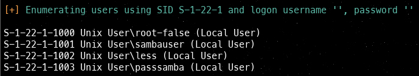

# Readme r00tless:
## Write up creado como ejercicio parcial 1 ciberseguridad r00tless
## Ejercicio realizado con la ayuda del writeup de Isma-yo y sk0pj3e

<br>

## 1. Ping

Una vez inicializada la maquina, lo primero que vamos a realizar es comprobar si hay ping con la maquina:

```bash
ping -c 3 172.18.0.2
```


Observamos que el ping fue exitoso.

## 2. Escaneo de puertos con nmap

Realizamos un escaneo de que puertos hay abiertos con nmap

```bash
nmap -p- -sS -sC -sV -vvv --min-rate 5000 -Pn 172.18.0.2
```
Teniendo el siguiente resultado:


De todo eso nos fijamos en lo siguiente:


Vemos que estan abiertos los siguientes puertos:

* **22/tcp — SSH** : Servicio SSH.
* **80/tcp — HTTP** : Pagina web.
* **139/tcp — NetBIOS/SMB** : Servicio SMB (samba)
* **445/tcp — SMB/CIFS** : SMB2/SMB3 disponible.

Miramos primero que nos encontramos en la pagina web (puerto 80), copiando la ip de la maquina en un buscador:


Vemos que es una pagina a la cual le podemos subir archivos, 
miramos si encontramos algo relevante en el codigo de la pagina:


En el cual no encontramos nada importante.

## 3. Fuzzing

Realizaremos un fuzzing para ver si nos encontramos con algun fichero que nos sea util.

Utilizando la herramienta de gobuster:

```bash
gobuster dir -u http://172.18.0.2 -w /usr/share/wordlists/dirbuster/directory-list-2.3-medium.txt -x php,html,txt
```


Vemos que hay un **"/upload.php"** el cual vamos a entrar y mirar que nos muestra:


Vemos que hay un **"/readme.txt"** en la cual vamos a entrar, mediante la pagina web, obteniendo lo siguiente:


El mensaje dice lo siguiente:

```
Es posible que el archivo que se está cargando se esté cargando en un .ssh/?
```

Esto nos da a entender que si subimos algun archivo en la pagina principal se subiran al **.ssh** de la maquina

## 4. Enum4lix

No sabemos que usuarios puede haber en la maquina, sin embargo, cuando hemos hecho el **nmap** hemos visto que tenia **Samba** instalado, por lo que podemos probar a ejecutar el comando **enum4linux** para ver que informacion nos da:


```bash
enum4linux 172.18.0.2
```

El cual tenemos el siguiente resultado:


Llegaremos a este apartado y solo le daremos **enter**:


Y nos encontraremos con lo siguiente:



Hay 4 posibles usuarios, asi que sabiendo que los archivos que subamos a la maquina iran al directorio .ssh podemos crear un par de claves con el comando ssh-keygen y subir la clave publica a la maquina victima.

## 5. Par Claves

Colocando el siguiente comando crearemos el un par de claves:

```bash
sudo ssh-keygen -t rsa -b 4096
```


Aqui colocamos la dirección donde queremos que quede guardada nuestra key, donde esta la maquina. En mi caso fue este:


Obtenemos lo siguientes archivos:


* **id_rsa**
* **id_rsa.pub**

Ahora pasamos la clave a un **authorized_keys**

```bash
sudo sh -c 'cat id_rsa.pub > authorized_keys'
```


Y le damos permisos a id_rsa:

```bash
sudo chmod 600 id_rsa
```


## 6. Subir Archivo  

Subimos el **authorized_keys** en la pagina web:


Seleccionamos el archivo:


Ya el archivo subido correctamente: 


## 7. Conexion SSH

Ahora nos conectaremos via ssh probando con los usuarios encontrados anteriormente, nos podremos conectar mediante el usuario **passamba**, colocando el siguiente comando:

```bash
sudo ssh passsamba@172.18.0.2 -i id_rsa
```


Ya dentro hacemos un **"ls"** para ver que nos muestra:


o tambien con **ls -trola** para mas ver mas cosas:


Esto aparenta ser una contraseña para entrar con otro usuario, entonces probamos con los usuarios restantes y vemos que podremos acceder con el usuario **sambauser**:


Y ya somos ahora **sambauser**

Ya dentro buscaremos alguna carpeta que tenga algo interesante, por ejemplo dentro de la carpeta **srv**:


y si seguimos explorando por ahi, encontraremos un **secret.zip**:


## 8. Servidor Python Puerto:8080

Para extraer el archivo **secret.zip**, nos lo pasamos a nuestra maquina atacante levantado un servidor en Python por el puerto **8080**:

```bash
python3 -m http.server 8080
```


Abrimos otra shell donde con un **wget** tomar el **secret.zip**

```bash
sudo wget http://172.18.0.2:8080/secret.zip
```

Y haciendo un **ls** vemos que ya tenenmos el **.zip**  

## 9. Extraccion del .zip

Vamos a crackearlo con zip2john y john:

```bash
sudo sh -c 'zip2john secret.zip > hash'
```


y ahora con el john:

```bash
sudo john --wordlist=/usr/share/wordlists/rockyou.txt hash
```


Ahi obtenemos la contraseña para extraer el **.zip**:

```bash
qwert
```

El cual hay dos formas para extraer el **.zip**:
* **1.** 
```bash
sudo unzip -P qwert secret.zip
```


* **2.**
```bash
sudo unzip secret.zip
```


Y ahora con **cat** vamos a visualizar lo que hay dentro del **.txt**:

```bash
cat secret.txt
```


Vemos que tenemos lo que parece ser, el usuario **root-false** con contraseña **"cGFzc3dvcmRiYWRzZWN1cmV1bHRyYQ=="**

Ahora decodificamos a **Base64**:

```bash
echo 'cGFzc3dvcmRiYWRzZWN1cmV1bHRyYQ==' | base64  -d
```


Todo esto se realiza en la nueva shell que creamos. 

## 10. Acceso al root-false

Y ahora pasamos a la anterior shell y vamos acceder con los nuevos datos que obtuvimos:

```bash
su root-false
```
Colocando la contraseña:

```bash
passwordbadsecureultra
```


Y efectivamente ahora solo **root-false**

Buscando que hay en su directorio home observamos lo siguiente:


Vemos que hay una **message.txt** al cual le hacemos un **cat** 

Parece ser un nuevo usuario llamado **mario**, con el mensaje **"pinguinodemarioelmejor"** que parece ser su contraseña

Si seguimos explorando por los directorios:


Entramos por el **/etc/**


Miramos la carpeta **apache2**


Entramos a la carpeta **sites-enabled**


y haremos un cat sobre **second-site.conf**

```bash
cat /etc/apache2/sites-enabled/second-site.conf
```


Vemos que hay otra pagina web a la que podemos acceder utilizando otra ip

Si hacemos un curl a la IP para ver el contenido de la web observamos lo siguiente:

```bash
curl http://10.10.11.5/
```

 

Si seguimos bajando encontraremos un apartado de login:


Probablemente podremos utilizar el usuario **mario** y la contraseña que habia dentro del **message.txt**, para ellos ejeuctaremos el siguiente comando:

```bash
curl -vvv -d 'username=mario&password=pinguinodemarioelmejor' http://10.10.11.5
```


En el apartado de location hay una nueva ruta donde puede haber algo, miraremos el contenido de esa ruta con el siguiente comando:

```bash
curl -vvv http://10.10.11.5/super_secure_page/admin.php/
```


Si seguimos bajando hasta el final, encontramos lo siguiente:


Encontramos un fichero algo sospechoso, veremos que contiene con el siguiente comando:

```bash
curl -vvv http://10.10.11.5/ultramegatextosecret.txt
```

## 11. Acceso a usuario less


Vemos el siguiente mensaje:


Parece ser un texto cualquiera, sin relevancia, pero podemos ver dos cosas que llaman la atención, el autor es **less** uno de los usuarios que encontramos al inicio y el mensaje con guion al piso **"Cristal_de_la_Aurora"**, parece como si se tratara de una contraseña.

Entonces lo probaremos:


Ahora somos el usuario **less**

Ejecutaremos el comando **sudo -l** para ver si podemos ejecutar algo con el usuario root sin utilizar contraseña:


Vemos que podemos ejecutar el comando **chown** para cambiar el propietario de los archivos.

Lo que haremos con el fichero **/etc/passwd**, donde una vez que seamos propietarios del fichero podremos editarlo para quitarle la **x** al usuario **root** y de este modo no tenga contraseña:

```bash
sudo chown less:less /etc/passwd
```


Aca no modifique el archivo con el **nano**, quitando la **x** por lo cual no pude acceder al **root**.


Modificando ahora si:


```bash
su root
```


Y ya somos root!!!

Y finalizamos.


<br><br>

# 10 Vulnerabilidades Encontradas:
Durante el desarollo de la maquina *r00tless* encontramos, **10** vulnerabilidades que comprometen al sistema:

### 1. Puertos abiertos:
Se encontraron 4 puertos abiertos:
* El puerto **22 - ssh**
* El puerto **80 - http**
* El puerto **139 - Samba**
* El puerto **445 - SMB2/SMB3**

### 2. Contraseñas poco seguras:
Se encontraron contraseñas poco seguras, debido a que usualmente comprometen el nombre del usuario dentro la contraseña.

### 3. Información critica expuesta en archivos Html:
Durante el realizamiento del **"curl"** de la segunda pagina web, encontramos informacion sensible expuesta en comentarios y como codigo dentro del formato **html**.

### 4. Exposición de ficheros y directorios sensibles:
Durante el listado de directorios y ficheros dentro de los posibles usuarios encontramos directorios y ficheros de alta sensibilidad expuestos de manera peligrosa y de fácil acceso para el atacante.

### 5. Escalada de privilegios:
El escalar privilegios dentro de la maquina aunque fue un poco extenso fue sencillo debido a la alta exposición de diferentes archivos sensibles, ademas de poco control, manejo y autenticación al momento de querer acceder a un usuario de mayor nivel

### 6. Exfiltracion de datos:
Durante el desarrollo de la maquina, se hizo necesario el realizar la extracción de un archivo desde la maquina victima hacia la maquina atacante, esto se facilito debido a la facilidad de levantar un servidor http a través de Python y posterior a esto realizar una petición de extracción del archivo desde la maquina atacante, lo que deja en claro la vulnerabilidad de la exfiltración de datos facilmente.

### 7. Aplicación web interna sin control de acceso real:
Durante el desarrollo del laboratorio r00tless se encontró una aplicación web interna que exponía páginas y endpoints sensibles sin autenticación ni verificación de roles: simplemente accediendo a la URL desde la red del contenedor se podía ver información de configuración.

### 8. Carga de archivos sin autenticación:
En r00tless se aprovechó que un endpoint aceptaba cargas de archivos sin pedir autenticación ni validar el contenido/tipo: subimos (o simulamos subir) un archivo malicioso/legítimo y el servidor lo dejó en un directorio servible

### 9. Uso de ofuscación (Base64):
Durante la inspección de archivos y tráfico del laboratorio r00tless se hallaron secretos (credenciales, tokens, configuración) “protegidos” mediante Base64. Como Base64 es solo una codificación reversible y no aporta confidencialidad, bastó con decodificar para recuperar la información sensible en texto claro.

### 10. Enumeración de usuarios (SMB/Samba):
En el entorno r00tless se realizó enumeración contra servicios SMB/Samba y se consiguieron listas de usuarios y recursos compartidos sin autenticación. Con esos nombres de usuario (y en algunos casos información adicional sobre shares) se pudo perfilar objetivos.


<br><br>

# 3 Vulnerabilidades Explotadas:

### 1. Escalada de privilegios

Para explotar esta vulnerabilidad lo que hicimos fue identificar primeramente la vulnerabilidad que como vimos en el desarrollo de la maquina al momento de realizar la ejecución para ver a que era sensible el sistema, vimos que era sensible al comando **Chown** que nos permite cambiar o modificar el propietario del archivo, por lo cual lo que hacemos es ejecutar el comando y asi una vez aprovechada esta vulnerabilidad le hacemos **nano** al archivo **passwd** y lo que hacemos es quitarle ese permiso que nos obliga a entrar con contraseña, y únicamente con realizarle el **su root**, ya estamos adentro, como se ve en las imagenes:

* Vemos que se puede ejecutar el comando **chown** 


* Lo ejecutamos:


* Se observa con el **cat /etc/passwd** la **x** en el **root** la cual vamos a quitar con **nano**:


Esto para poder ser **root** sin colocar la contraseña:


* Teniendo como resultado: 


<br>

### 2. Exfiltración de datos:

Para esta segunda vulnerabilidad tenemos 2 partes, primeramente levantamos un servidor **http** con ayuda de **Python3** y ademas un puerto en este caso utilizamos el puerto **8080** todo esto desde la maquina victima, siguiendo con la segunda parte lo que hacemos es realizarle una petición desde la maquina atacante hacia e servidor que acabábamos de levantar en nuestra maquina victima todo esto con el fin de obtener un archivo en especifico que en este caso era **secret.zip**, y finalmente tendríamos nuestro archivo en nuestra maquina(ATACANTE), lo que catalogaríamos como una exfiltración de datos, como se ve acontinucación: 


* Vemos como encontramos el archivo **secreto.zip**, y como levantamos el servidor **http** por **pyhton3** y la peticion **wget** para capturar el archivo en otra terminal.

<br>

### 3. Información crítica expuesta en formatos html:

Durante el desarrollo de la maquina encontramos la vulnerabilidad de que al momento de hacerle **curl** a la dirección ip del segundo sitio encontramos que exponen información sensible dentro de formato **html**; para poder explotar esta vulnerabilidad lo que hacemos es realizar **curl** a las 2 direcciones expuestas dentro del html, encontrando así información sensible y de alto valor:

* La primera con los datos de **mario** con contraseña **pinguinodemarioelmejor**, despues de encontrar la dirección ip:


* La segunda accediendo mediante el **super_secure_page/admin.php**:


Encontrando como destacado: 


Llegando asi a obtener la información del usuario **less** y lograr ser **root**.


<br><br>

Ya como ultimo:
### Buscando en los registros del CVE y con ayuda de IA no se encuentran registros de estas vulnerabilidades, se encuentran posibles etiquetas a estas vulnerabilidades mas sin embargo se descartan por no etiquetar de manera objetiva la vulnerabilidad presentada por el equipo REDOPS.